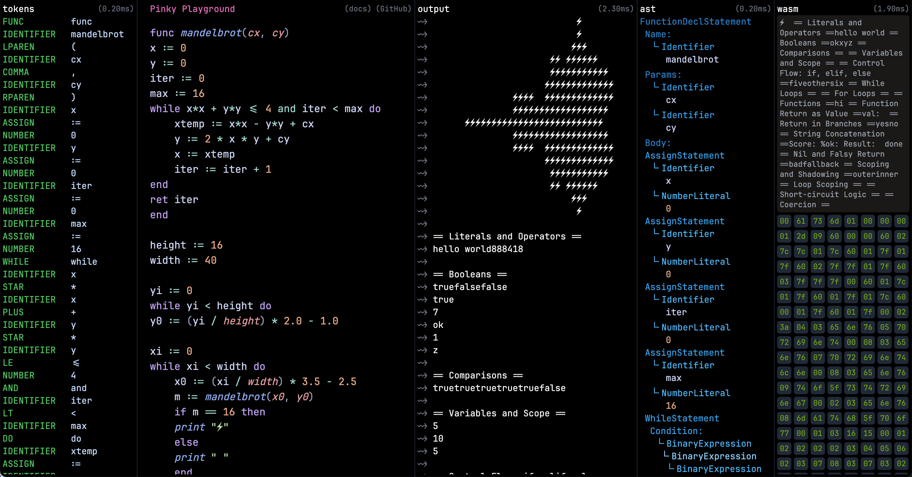

# Pinky Lang WebAssembly Compiler

### A lexer, parser, and WebAssembly (wasm) generator

I built this to apply what I'm learning of lexers, parsers, and code generators. And to practice writing WebAssembly at the bytecode level. Feedback and contributions are welcome!

The compiler code has been moved to a separate package, [pinky-compiler](https://github.com/KevinBatdorf/pinky-compiler) and published on npm. Go there to see the code and documentation for the compiler itself.

Interactive demo here [http://pinky.cool.omg.lol](http://pinky.cool.omg.lol).

---

Pinky is a simple scripting language that is designed for learning more about compilers and interpreters. It has a very simple syntax and is designed to be easy to understand. Read more about it at [https://pinky-lang.org/](https://pinky-lang.org/).

If you want to learn more about this stuff, I highly recommend the [Compilers, Interpreters & Formal Languages](https://pikuma.com/courses/create-a-programming-language-compiler) course by [Pikuma](https://pikuma.com/). It's a beginner-friendly course that really goes into much more detail than you would expect (or if you know Pikuma, you'd definitely expect this!).
